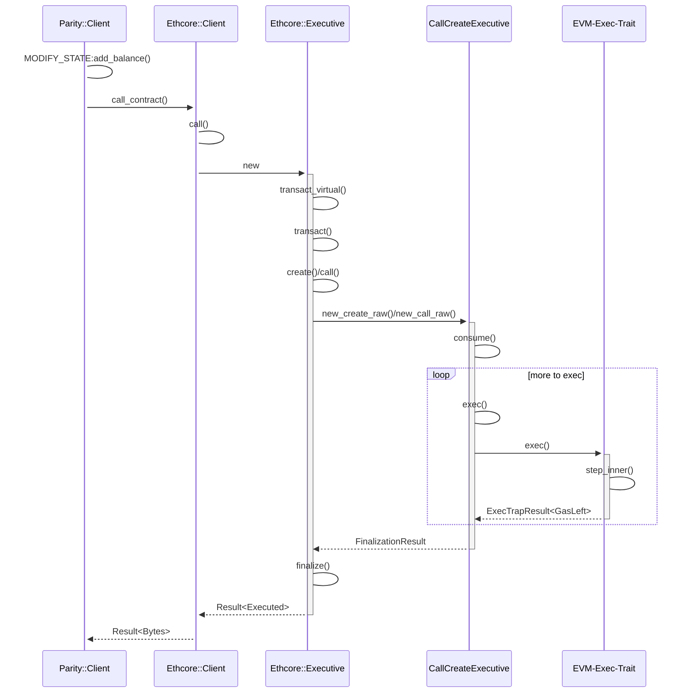

# EVM Dev Notes 

## Awesome List: 

Ordered by recommended sequence of reading. (From simple overviews to more details)

- [High Level Overview of EVM](https://hackernoon.com/getting-deep-into-evm-how-ethereum-works-backstage-ac7efa1f0015) A good starting point for anyone with no prior knowledge of EVM 
- [Beigepaper](https://github.com/chronaeon/beigepaper/blob/master/beigepaper.pdf) A summarized version of EVM specs that should be easier to read. 
- [Yellow Paper](https://ethereum.github.io/yellowpaper/paper.pdf) Official specs of EVM 
  - [RLP introduction](https://github.com/ethereum/wiki/wiki/RLP) A detailed intro of RLP 


## Parity(Ethcore) Overview

### Overview

This part describes the detailed implementation of `parity` and in paritcular, its `ethcore` module.  The documentation is not hosted on Crate.io, therefore it is better to build the documents using `rustdoc` offline. 

- `parity`:  consists of parity client 
- `ethcore` : the core module that has implementation of the EVM
  - `src` : contains `ethcore` modules for blockchain, databases, account,  executor for the EVM, and world states
  - `evm`: implements the EVM for parity. Most of the implementatin done through the `interpreter` sub-module. 
  - `vm`: EVM interface 
- `evmbin`:  command line tool for EVM implementation (backed by `EvmTestClient` in `ethcore`)
- `vm`: defines the interface for EVM, such as the `ActionParam` for invoking the EVM, `ReturnData`, and cost schedule. Also defines the trait `Ext` (externalities interface)  and the `Exec` trait that EVM implementation has to do. This will allow plug and play of various EVM implementation (`Interpreter` or `Wasm`)
- `wasm`: WebAssembly EVM, it is essentially a wrapper that defines entry points to [`wasmi`](https://paritytech.github.io/wasmi/wasmi/index.html) . 


### Major Modules

#### Client (@ethcore/src/client)

Module that represents a client that is backed by database. 

##### struct Client

```rust
pub struct Client {
    /// EthEngine used for consensus 
	engine: Arc<EthEngine>,
    
	/// Client uses this to store blocks, traces, etc.
	db: RwLock<Arc<BlockChainDB>>,
	
    ///Manages shared global state cache which reflects the canonical
    ///state as it is on the disk
	state_db: RwLock<StateDB>,
	
    ///Wrapper of VM factories
	factories: Factories,
    
    ///[OMITTED FIELDS]
}
```

###### Important functions: 

```rust
///Get the world state at a certain block 
///called by the Parity client to get access to the state and apply
///transactions. 
fn state_at(&self, id: BlockId) -> Option<State<StateDB>>

///Designed to be used for calling contracts. Eventually call call()
fn call_contract(
    &self, 
    id: BlockId, 
    address: Address, 
    data: Bytes
) -> Result<Bytes, String>

///Makes a non-persistent transaction call 
fn call(
    &self, 
    transaction: &SignedTransaction, 
    analytics: CallAnalytics, 
    state: &mut Self::State, 
    header: &Header
) -> Result<Executed, CallError>

```


#### State(@ethcore/src/state/mod.rs)

Representation of the entire state of all accounts in the system. Contains structs such as Account, Substate, State.

##### struct State 

Applying a given transaction will change the state by calling `apply()` on a state, which will create an `Executive` to be described below to execute the transaction. 

After executed the transaction, changes to the accounts in cache (an abstract data structure defined in `state` as well) will be `commit()`


#### Executive(@ethcore/src/executive.rs)

Module that executes a transaction 

##### struct Executive

Does a couple of things:

- `transact()` that executes a transaction depending on `Action`:
  - Case `Create`: `create()` to create a new contract 
  - Case `Call`: `call()` to call a contract 
- both `create()` and `call()`will initialize a `CallCreativeExecutive` instance, which calls `consume()` to execute the executive instance. 
- `consume()` will run in a loop to execute the executive by calling `exec()` on the `CallCreativeExecutive` instance or resuming the execution from a previous `exec()` by calling `resume_call()` or `resmue_create()`. [src for executive.rs](https://github.com/paritytech/parity-ethereum/blob/5319d33bc6b22ac3ca06e561912c6cc4ca472e26/ethcore/src/executive.rs)
- `finalize` finalize a transaction with refunds and suicides (`state.add_balance()` or `state.kill_account()`)

###### Important APIs

```rust
///A function that delegates the transaction with the tracer
///Fields and returns omitted
pub fn transact() {}

///Calls contract function with given contract params.
///(fields/returns omitted)
pub fn call(){}

///Creates a contract 
pub fn create() {}

///Finalize a transaction 
pub fn finalize(){}
```


##### struct CallCreateExecutive

Represents a raw call/create action that is being executed or resumed. Thus there can be the following types of `CallCreateExecutve`, that is identified by its `type` field. 

- For `ExecCall` and `ExecCreate` cases: 

  It will invoke the EVM by calling `evec` on the `Box<Exec>` trait object. Please see the section below for details about `Exec` and its implementors. 

- For `ResumeCall` and `ResumeCreate` cases: 

  It will resume the execution trap and invoke `resume_call()` and `resume_create` to obtain a `Box<Exec>` . The two `resume_xxx` functions are required by the Trait `ResumeCall` and `ResumeCreate` in `ethcore/vm/src/lib.rs`

  The `exec` function will then be called by the `Box<Exec>`, which invokes the EVM


```rust
enum CallCreateExecutiveKind {
    Transfer(ActionParams),
    CallBuiltin(ActionParams),
    ExecCall(ActionParams, Substate),
    ExecCreate(ActionParams, Substate),
    ResumeCall(OriginInfo, Box<ResumeCall>, Substate),
    ResumeCreate(OriginInfo, Box<ResumeCreate>, Substate),
}
```

###### Important Functions

```rust
///Create an CallCreativeExecutive instance based on the transaction type
pub fn new_call_raw() {}
pub fn new_create_raw() {}

///Consume the exectuvie instance by executing or resuming it. It will
///delegate calls to the ones below

///Resume execution by invoking the EVM 
pub fn resume_call() {}
///Resume create by calling the EVM 
pub fn resume_create() {}

///Execute the executive and traps when a sub-call/create action is requied, which
///will be resumed by resume_call() or resume_create
///It will call others by calling the EVM 
pub fn exec(){ }


```


#### VM (@ethcore/vm/src/lib.rs)

It defines the Trait of `Exec` which is the virtual machine interface API that execute a transaction. 

The `exec` function is defined as below: 

```rust
/// This function should be used to execute transaction.
/// It returns either an error, a known amount of gas left, or parameters to
/// be used to compute the final gas left.
/// Ext represents the externalities for EVMs
fn exec(self: Box<Self>, ext: &mut Ext) -> ExecTrapResult<GasLeft>;
```

In the current ethcore, there are two different implementors for the `Exec` traits, `Interpretor<Cost>` and `WasmInterpreter` which will be covered in the section below. In addition, each EVM also takes in a `Ext` (aka Externalities) that describes the external states in which the EVM is invoked. 


#### Externalities(@ethcore/src/externalities.rs)

Implements the `Ext` trait. This struct will be passsed into the EVM. Its definitions include essential fields such as: 

```rust
pub struct Externalities<'a, T: 'a, V: 'a, B: 'a> {
    state: &'a mut State<B>,
    env_info: &'a EnvInfo,
    depth: usize,
    stack_depth: usize,
    origin_info: &'a OriginInfo,
    substate: &'a mut Substate,
    machine: &'a Machine,
    schedule: &'a Schedule,
    output: OutputPolicy,
    tracer: &'a mut T,
    vm_tracer: &'a mut V,
    static_flag: bool,
}
```


#### EVM(@ethcore/evm)

##### struct Interpretor

This module provides the implementation of the EVM. When its `exec` function is invoked through various ways by the `CallCreateExecutive`, the `step_inner` function which does most of the job will be called. It wil extract opcode from the contract reader, and executes the opcode on the `Stack`.

The [`exec_instruction()` ](https://github.com/paritytech/parity-ethereum/blob/5319d33bc6b22ac3ca06e561912c6cc4ca472e26/ethcore/evm/src/interpreter/mod.rs#L479)in the `step_inner` function will match the `Instruciton` variant to the corresponding modifications to the `Stack`

```rust

fn exec_instruction(&mut self,
                        gas: Cost,
                        ext: &mut vm::Ext,
                        instruction: Instruction,
                        provided: Option<Cost>)
                        -> vm::Result<InstructionResult<Cost>>
```


##### struct Stack

A generic container interface which stores the parameters and immediate results from the execution of the contract. 

##### enum Instruction 

macro implemented Enum of a list of instructions defined in EVM 


### Flow:

To summarize the above,  here is an simplified overview of the Structs/Modules invovled for executing a transaction. 

Would highly suggest to trace the source code for a more complete picture. 

There are multiple occassions where the `Ethcore::Client` will be invoked. 




### WASM

Another EVM implemention other than the `Interpreter` is the WASM implementation. 

It has dependency to [wasmi ](https://github.com/paritytech/wasmi). 

:warning: TODO : wasmi implementation 


## 